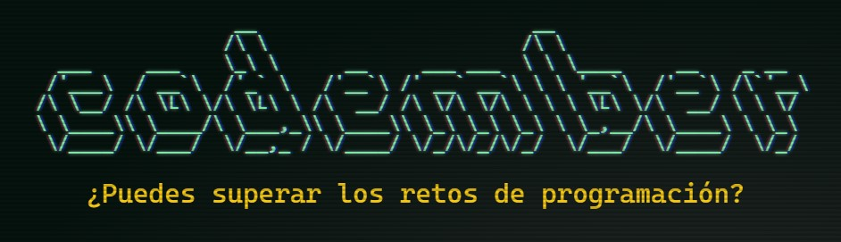

<div align="center">
   
</div>

<br>

# Codember

Soluciones a los problemas y secretos del reto [Codember](https://codember.dev) de [midudev](https://github.com/midudev).


## Problemas

| No. Problema | Problema | Solucion | Codigo |
| :---: | :---: | :---: | :---: |
| 1 | [¡Arregla Twitter!](challenges/challenge-01/README.md) | 156@giroz | [Typescript](challenges/challenge-01/C01.ts) <br> [Python](challenges/challenge-01/C01.py) <br>  [C#](challenges/challenge-01/C01.cs) |
| 2 | [¡Atrapa a esos ciber criminales!](challenges/challenge-02/README.md) | thanks for playing codember please share | [Typescript](challenges/challenge-02/C02.ts) <br> [Python](challenges/challenge-02/C02.py) <br> [C#](challenges/challenge-02/C02.cs) |
| 3 | [La zebra de colores](challenges/challenge-03/README.md) | 30@red | [Typescript](challenges/challenge-03/C03.ts) <br> [Python](challenges/challenge-03/C03.py) <br> [C#](challenges/challenge-03/C03.cs) |
| 4 | [Encuentra la contraseña de tu amigo](challenges/challenge-04/README.md) | 165-23555 | [Typescript](challenges/challenge-04/C04.ts) <br> [Python](challenges/challenge-04/C04.py) <br> [C#](challenges/challenge-04/C04.cs) |


## Secretos

- [Secreto 1](secrets/Secret-01.md)
- [Secreto 2](secrets/Secret-02.md)
- [Secreto 3](secrets/Secret-03.md)
- [Secreto 4](secrets/Secret-04.md)
- [Secreto 5](secrets/Secret-05.md)
- [Secreto 6](secrets/Secret-06.md)
- [Secreto 7](secrets/Secret-07.md)


## Comandos

- ```$ help``` 
- ```$ hint```
- ```$ share```
- ```$ version```
- ```$ rank```
- ```$ score```
- ```$ cat <file>```
- ```$ cd <folder>```
- ```$ clear```
- ```$ open <file>```
- ```$ ls```
- ```$ say```
- ```$ ping```
- ```$ cowsay```
- ```$ countdown```
- ```$ curl```
- ```$ confetti```
- ```$ play```
- ```$ mail```
